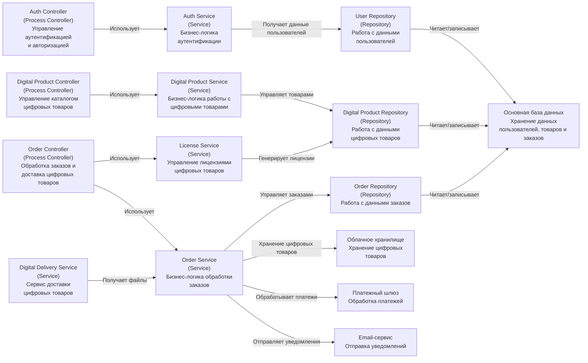
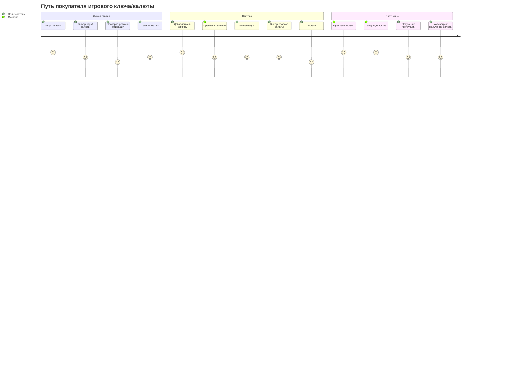
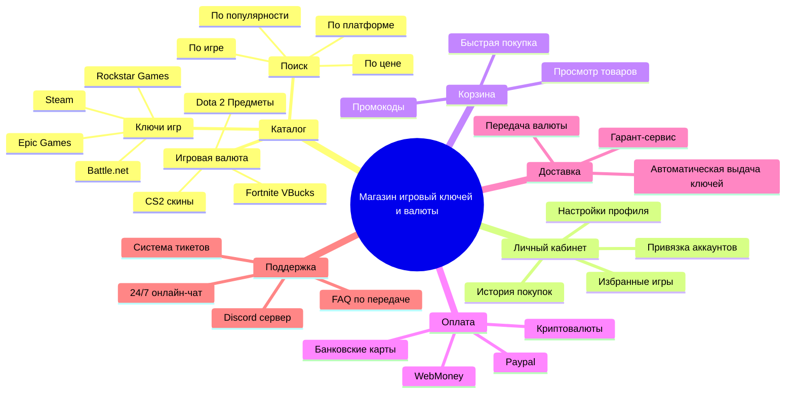
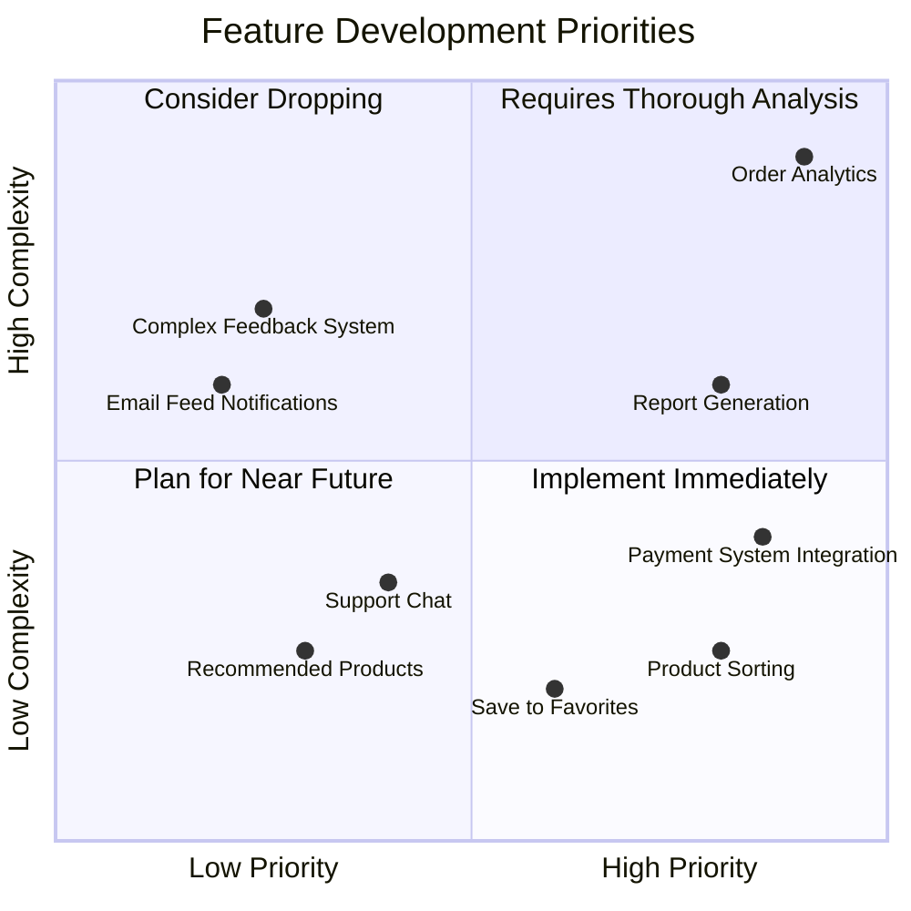
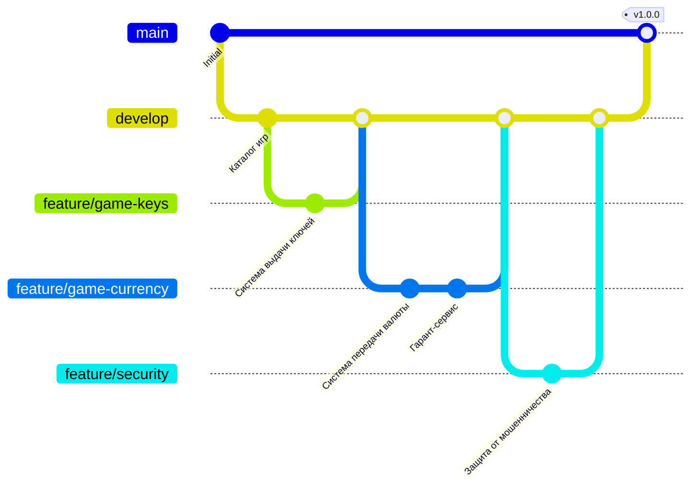

# Интернет-магазин цифровых товаров

## Обзор проекта

Приложение представляет собой интернет-магазин, предназначенный для покупки цифровых товаров из сферы игр, т.е. игровая валюта, виртуальные предметы и т.д

## Архитектура системы

Архитектура построена по многоуровневому принципу и состоит из следующих ключевых компонентов:

- Уровень контроллеров (Controllers):
    - Auth Controller отвечает за процессы аутентификации и авторизации
    - Digital Product Controller управляет каталогом цифровых товаров
    - Order Controller обрабатывает заказы и доставку товаров
    - Digital Delivery Service занимается непосредственно доставкой цифровых товаров

- Уровень сервисов (Services):
    - Auth Service реализует бизнес-логику аутентификации
    - Digital Product Service содержит бизнес-логику работы с цифровыми товарами
    - License Service управляет лицензиями цифровых товаров
    - Order Service обрабатывает бизнес-логику заказов

- Уровень репозиториев (Repositories):
    - User Repository работает с данными пользователей
    - Digital Product Repository управляет данными цифровых товаров
    - Order Repository хранит и управляет данными заказов

- Внешние системы:
    - Облачное хранилище для хранения цифровых товаров
    - Платежный шлюз для обработки платежей
    - Email-сервис для отправки уведомлений
    - Основная база данных для хранения всех данных (пользователей, товаров и заказов)

- Архитектура следует принципам:
    - Разделения ответственности (каждый компонент отвечает за свою конкретную функцию)
    - Слабой связанности (компоненты взаимодействуют через четко определенные интерфейсы)
    - Иерархической организации (контроллеры используют сервисы, сервисы используют репозитории)

Такая архитектура обеспечивает:
- Масштабируемость системы
- Простоту поддержки и модификации отдельных компонентов
- Чёткое разделение бизнес-логики и доступа к данным
- Возможность независимого тестирования компонентов

## User Journey

Эта диаграмма описывает пользовательский путь при покупке игрового ключа или внутриигровой валюты на сервисе. Процесс разделен на три основных этапа:

1. Этап выбора товара:
  - Пользователь заходит на сайт
  - Выбирает интересующую игру или внутриигровую валюту
  - Проверяет региональные ограничения по активации
  - Сравнивает цены на товар

2. Этап покупки:
  - Добавляет выбранный товар в корзину
  - Система автоматически проверяет наличие товара
  - Пользователь проходит авторизацию
  - Выбирает удобный способ оплаты
  - Совершает оплату

3. Этап получения товара:
  - Система проверяет статус оплаты
  - После успешной оплаты генерирует ключ активации
  - Пользователь получает инструкции по использованию
  - Выполняет активацию ключа или получает внутриигровую валюту

На диаграмме также отмечен уровень удовлетворенности (от 1 до 5) для каждого шага и указано, кто выполняет действие - пользователь или система. Наиболее высокие оценки (5) получили начальные этапы взаимодействия (вход на сайт, добавление в корзину) и системные операции (проверка оплаты, генерация ключа), что говорит об их оптимальной реализации.

## Mindmap 

Mind map показывает 6 основных разделов магазина игровых ключей и валюты:

- Каталог
- Личный кабинет
- Корзина
- Оплата
- Доставка
- Поддержка

Эти разделы формируют основную структуру магазина, обеспечивая весь необходимый функционал для работы платформы.

## Quadrant-граф

Эта диаграмма приоритетов разработки функционала (Quadrant Chart) разделяет задачи по двум осям:
- По оси X отражен приоритет (от низкого к высокому)
- По оси Y отражена сложность реализации (от низкой к высокой)

Квадранты диаграммы:
1. "Implement Immediately" (высокий приоритет, низкая сложность)
2. "Requires Thorough Analysis" (высокий приоритет, высокая сложность)
3. "Consider Dropping" (низкий приоритет, высокая сложность)
4. "Plan for Near Future" (низкий приоритет, низкая сложность)

Такое распределение помогает команде разработки определить:
- Что нужно реализовать в первую очередь
- Какие задачи требуют тщательного планирования
- Какой функционал можно отложить или пересмотреть
- Где нужен дополнительный анализ перед реализацией

## Workflow разработки (git-граф)

Этот граф в стиле Git показывает процесс разработки программного проекта. Он иллюстрирует создание и развитие веток, добавление новых функций (например, каталог игр, система ключей, передача валюты, защита от мошенничества), а также их слияние в основные ветки разработки. Финальный этап включает объединение изменений в главную ветку и выпуск версии с тегом v1.0.0

